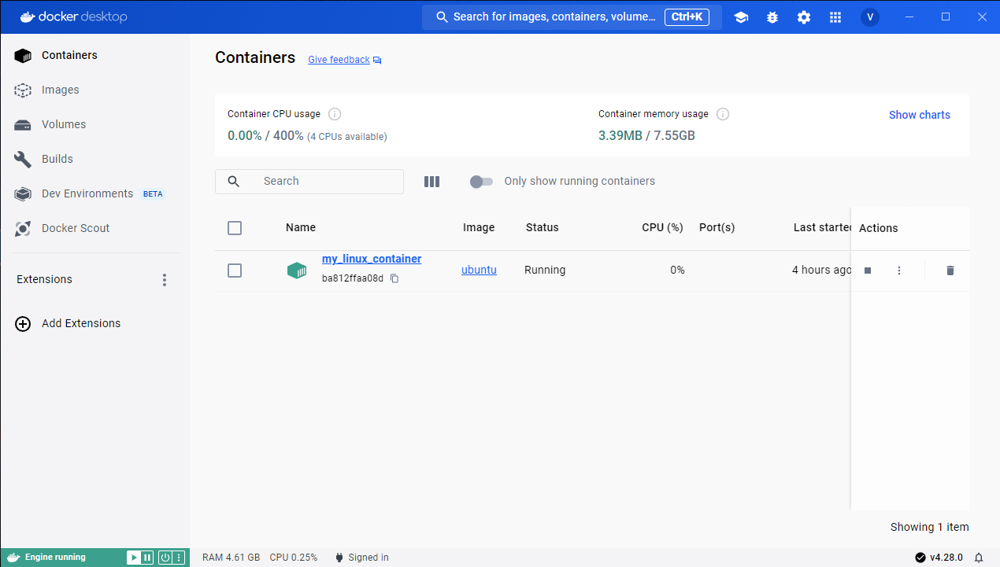
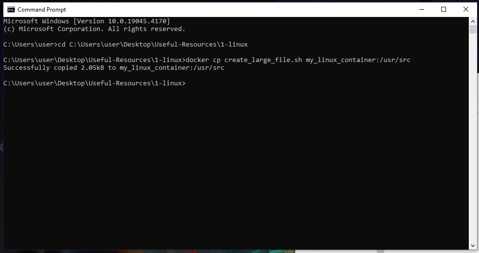

Step 1: Setup a container with an Ubuntu image running locally

Step 2: Copy the script to the container

Step 3: Create user john and run the script

useradd john

bash /usr/src/create_large_file.sh

Unfortunately at this point the Docker container started to exit immediatly as I try to run it and I don't think I have sufficient time to find the cause.

In the meantime I wrote the bash script and tested it locally on my linux machine. ("it works on my machine", I know, the irony..)

